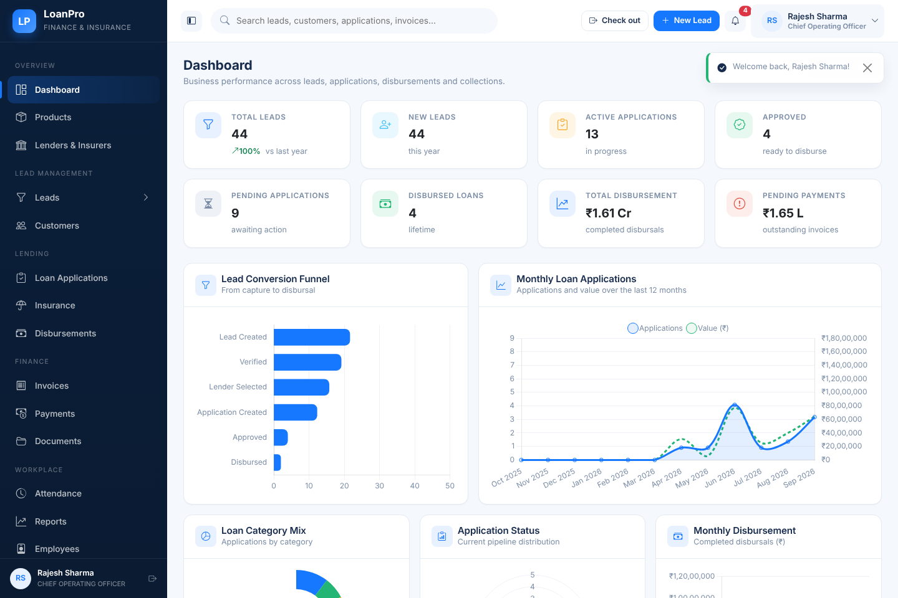
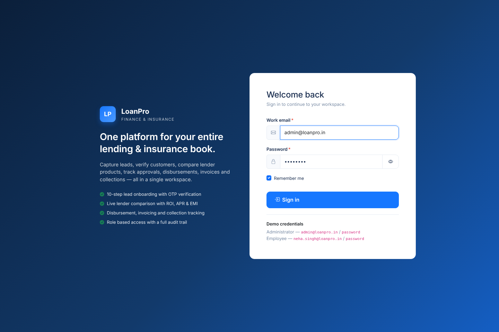
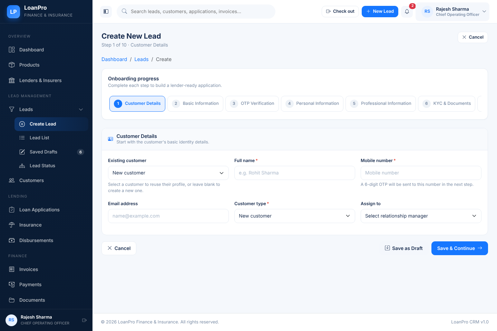
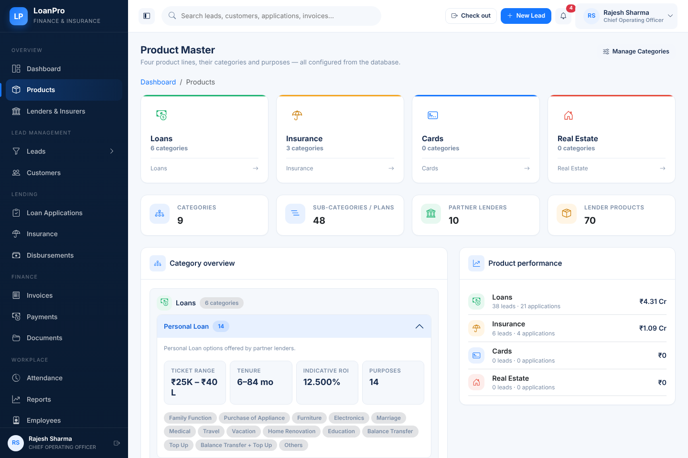

# LoanPro — Finance & Insurance Management System

LoanPro is a production-style **CRM / loan-origination platform** for NBFCs, DSAs and
insurance intermediaries: lead capture with OTP verification, lender product
comparison, application processing, disbursement, invoicing, collections,
attendance and reporting — in one role-aware workspace.

Everything the business screens show comes from the database (products,
categories, lenders, products, employees, customers, applications, statuses,
document types, settings); nothing is hard-coded in the views, so an
administrator can extend the catalogue from the UI.

| | |
| --- | --- |
|  |  |
|  |  |

## Tech stack

* **Laravel 12** (PHP 8.2+) — MVC with form requests, policies, gates, services,
  events/listeners, jobs, notifications and API resources
* **Blade + Bootstrap 5** design system (`resources/css/app.css`) with reusable
  components (`components/`), Chart.js dashboards, vanilla JS fetch/AJAX layer
* **Vite** asset pipeline (`npm run build` → `public/build`)
* **MySQL** in production/staging (`.env` → `DB_CONNECTION=mysql`); SQLite is used
  for the local demo database that ships with this sandbox

## Roles

| Role | Access |
| --- | --- |
| **ADMIN** | Every module, every record, master data, employees, settings, audit log |
| **EMPLOYEE** | Only the modules granted to the role, and only records they own or are assigned to (`created_by = self OR assigned_to = self`) |

Authorisation is enforced server-side (middleware + policies + gates + Eloquent
query scopes); the UI merely hides what the user cannot reach.

## Modules

Dashboard (KPI cards, 5 charts and a recent-leads table) · Product master
(Loans / Insurance / Cards / Real Estate, fully database driven) · Lead
management (10-step wizard with OTP, drafts, lender shortlisting, journey
timeline) · Customers (CRM tabs: overview, personal, professional, KYC, leads,
applications, loans, insurance, payments, documents, activity) · Loan
applications and approvals · Insurance · Invoices with PDF/print · Payments ·
Disbursements · Notifications (11 types) · Attendance (check-in/out, monthly
summary, leave) · Reports (10 reports, Excel + PDF export, print) · Employees ·
Master management (15 masters) · Settings · Audit log.

## Local setup (with PHP + Composer available)

Full Linux walkthrough (installs, MySQL vs SQLite, troubleshooting):
**[docs/LOCAL-SETUP.md](docs/LOCAL-SETUP.md)** — clone commands ke saath:
**[docs/CLONE-AND-RUN.md](docs/CLONE-AND-RUN.md)**.

> The complete application lives on the `arena/01a0d844-loan-pro` branch:
> `git clone -b arena/01a0d844-loan-pro https://github.com/Mr-argha-das/loan_pro.git`

```bash
cp .env.example .env          # set DB_* for MySQL
composer install
php artisan key:generate
php artisan migrate --seed    # roles, products, masters, lenders + demo data
npm install && npm run build
php artisan serve             # http://127.0.0.1:8000
```

### Demo accounts

| Role | Email | Password |
| --- | --- | --- |
| Administrator | `admin@loanpro.in` | `password` |
| Employee | `neha.singh@loanpro.in` | `password` |

Dev OTP for the lead wizard is `123456` (`OtpService` in local/dev mode).

## Running inside the Arena sandbox

The sandbox has no native PHP, no Docker, no Packagist and no getcomposer.org,
and its storage is wiped between sessions. `tools/sandbox/up.sh` therefore
rebuilds the whole stack from what *is* reachable (npm, PyPI, codeload.github.com)
and starts the server:

```bash
bash tools/sandbox/up.sh            # PHP runtime → vendor/ → .env + SQLite → assets → serve :8000
bash tools/sandbox/up.sh --fresh    # same, plus a re-seed
```

* PHP 8.4 runs from WebAssembly (`@php-wasm/node`) behind `tools/sandbox/runtime/php.mjs`
  (a `php` CLI for Artisan) and `serve.mjs` (the HTTP server on `0.0.0.0:8000`).
* `vendor/` is assembled by `tools/sandbox/build-vendor.py` from the locked
  package archives with Composer-compatible autoload metadata.
* Browser verification: `tools/qa/setup-browser.sh`, then
  `node tools/qa/verify.mjs` (sign-in + every module, asserting styled output)
  and `node tools/qa/interactions.mjs` (uploads, PDF/XLSX exports, wizard, roles).

See `tools/sandbox/README.md` for details.
